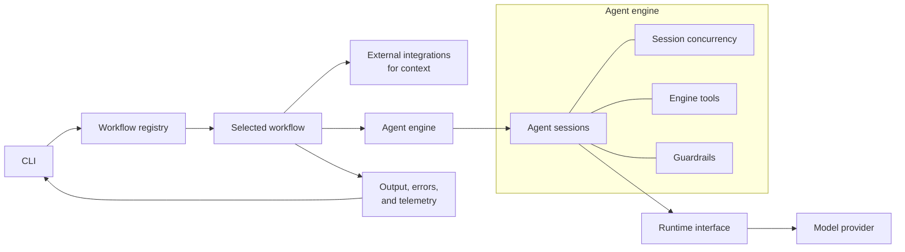

# LLM workflows

LLM workflow runner for pipeline automation.

## Project structure

```
src/
  index.ts        bin shim
  cli/            argv parsing and one module per command
  workflows/      one folder per capability (vertical slices) plus the registry
    review/       the code review workflow (agents, prompt, tools, report)
    ...
  engine/         workflow-agnostic agent engine (guardrails, config, prompt, tools)
  runtime/        LLM runtime port plus the pi adapter
  integrations/   external systems (ports plus adapters)
  shared/         cross-cutting infrastructure (env, logger)
```

## Architecture



<!-- BEGIN GENERATED ENVIRONMENT VARIABLES -->

## Environment variables

Application-wide variables are discovered from `cleanEnv` schemas. Workflow-specific variables are documented with their workflow.
Per-agent overrides use the uppercased agent id as the prefix.

| Environment variable | Type | Default | Choices | Description |
| --- | --- | --- | --- | --- |
| `<AGENT>_*` | `Varies` | `Varies` | `Varies` | Per-agent overrides for `ENABLED`, `MODEL_NAME`, `MODEL_SAMPLING_PARAMS`, `CONTEXT_WINDOW`, `MAX_OUTPUT_TOKENS`, `TIMEOUT_MS`, `INPUT_TOKEN_BUDGET`, `OUTPUT_TOKEN_BUDGET`, `TOOL_LOOP_THRESHOLD`, `TOOL_FAILURE_THRESHOLD`, `SOFT_LIMIT_RATIO`. Defaults come from the corresponding DEFAULT_* variables. |
| `LOG_LEVEL` | `str` | `INFO` | `DEBUG, INFO, ERROR` | The log level for the application. |
| `LOG_DIR` | `str` | `/tmp/llm-workflows` | `—` | The directory for log files. Holds combined.log and one file per agent. An empty value disables file logging. |
| `MODEL_API` | `str` | `openai-completions` | `openai-completions` | The model API to use for the agent. |
| `MODEL_PROVIDER` | `str` | `custom` | `custom, openrouter` | The model provider to use for the agent. |
| `MODEL_BASE_URL` | `str` | `—` | `—` | The base URL for the model API. |
| `MODEL_API_KEY` | `str` | `—` | `—` | The API key for the model API. |
| `REPO_DIR` | `str` | `—` | `—` | The path to the repository directory. |
| `DEFAULT_MODEL_NAME` | `str` | `—` | `—` | The default model name for agents. |
| `DEFAULT_MODEL_SAMPLING_PARAMS` | `json` | `{}` | `—` | The default model sampling parameters for agents. |
| `DEFAULT_CONTEXT_WINDOW` | `num` | `262144` | `—` | The default model context window for agents. |
| `DEFAULT_MAX_OUTPUT_TOKENS` | `num` | `32768` | `—` | The default maximum model output tokens for agents. |
| `DEFAULT_TIMEOUT_MS` | `num` | `300000` | `—` | The default wall clock timeout in milliseconds for an agent session. Zero disables the timeout. |
| `DEFAULT_INPUT_TOKEN_BUDGET` | `num` | `131072` | `—` | The default input token budget for an agent session, including cache-read tokens. Zero disables the budget. |
| `DEFAULT_OUTPUT_TOKEN_BUDGET` | `num` | `32768` | `—` | The default output token budget for an agent session. Zero disables the budget. |
| `DEFAULT_TOOL_LOOP_THRESHOLD` | `num` | `5` | `—` | The default number of consecutive identical tool calls before an agent is terminated. Zero disables the limit. |
| `DEFAULT_TOOL_FAILURE_THRESHOLD` | `num` | `5` | `—` | The default number of consecutive failures of the same tool before an agent is terminated. Zero disables the limit. |
| `DEFAULT_SOFT_LIMIT_RATIO` | `num` | `0.8` | `—` | The default ratio of a hard guardrail limit at which a soft warning is issued. |
| `AGENT_MAX_CONCURRENCY` | `num` | `5` | `—` | The maximum number of agent sessions that may run concurrently. Zero disables the limit. |

<!-- END GENERATED ENVIRONMENT VARIABLES -->
