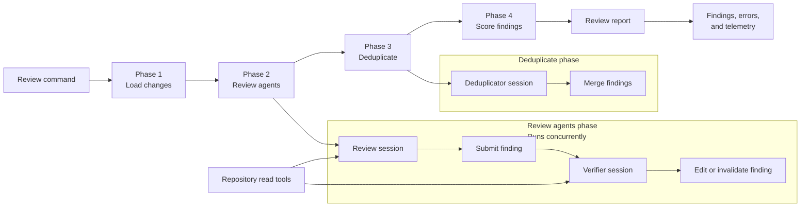

# Review

Code review workflow

## Architecture

<!-- BEGIN GENERATED ENVIRONMENT VARIABLES -->

## Environment variables

Workflow-specific variables are discovered from `cleanEnv` schemas in this workflow.

| Environment variable | Type | Default | Choices | Description |
| --- | --- | --- | --- | --- |
| `GIT_DIFF_PATH` | `str` | `—` | `—` | The path to the git diff file. |
| `REVIEW_MODE` | `str` | `multi` | `multi, single` | The review architecture. multi runs the specialized review agents, single runs one generalist agent. |

<!-- END GENERATED ENVIRONMENT VARIABLES -->